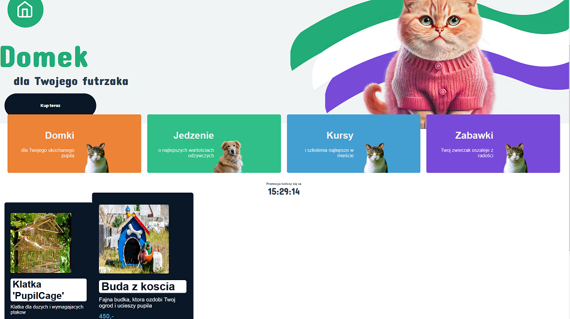

## RUN DEV

#### Start sails.js server
````
cd ./backend 
npm start
````
#### After loading the sails server you will be able to use the built VUE project directly from the server router
````
port 1337
````
#### You can run the VUE application in developer mode
````
cd ./jasio
npm run serve
````

________
### The application then works on both ports

#### Backend(sails.js) port = 1337
#### Frontend(VUE) port = 8080

--------

# Contains
#### * vue authguard middleware
#### * sails session and middleware
#### * vue user interface
#### * image and content upload/edit/delete
#### * proxy port to keep session working in dev mode

----------

# Description
### CRUD application with the use of VUE and Sails.js on the theme: Pet house shop

---------
